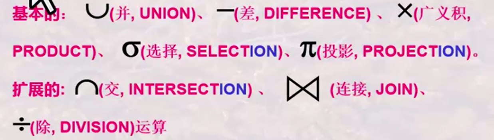

## 301什么是关系模型？

### 关系模型的三个要素：

**1.基本结构（table）**

**2.基本操作：**

**3.完整性约束：**

**实体完整性、参照完整性和用户自定义的完整性**

### 开发软件系统的一种思维

小总结：

**关系模型即使处理表的，主要是有三要素组成基本操作、基本结构、完整性约束。**

**关系模型的优点主要是在于规范化，更加便于数据库的使用。**

**关系模型更有利于数据库系统的发展，支撑理论基础，更加的规范化，便于使用理解。**