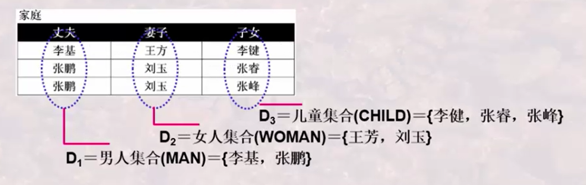
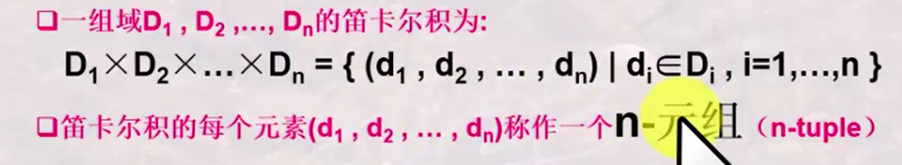
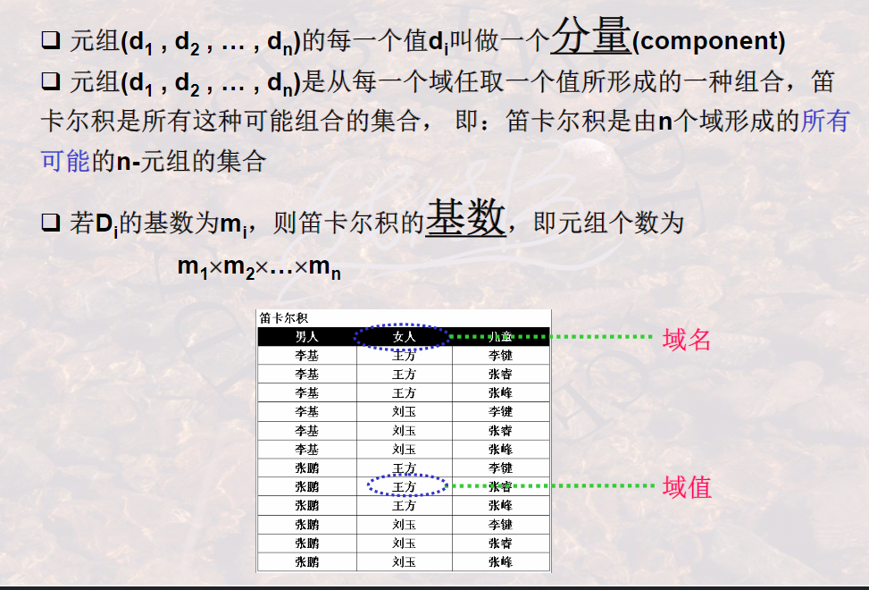
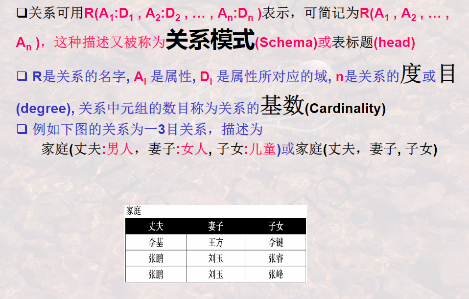

## 302什么是关系？

**

**关系是笛卡尔积的子集，关系和表并不完全相同，关系是数据结构，表是数据的逻辑结构。**

### 域

**一组值的集合，这组织具有相同的数据类型**

例子：

集合中元素的个数成为**基数**

### 笛卡尔积

### 关系

关系：**一组域D1、D2、D3、D4、D5.....、Dn的笛卡尔积的子集.**

**笛卡尔积中具有某些意义的那些元组被称为是一个关系.**

由于关系的不同列可能来自不同的域，为了区分可以给每一列取一个名字，即为**属性**

关系的这中表示又可以称为**关系模型**

### 关系模式与关系

同一关系模式下，可有很多的关系

关系模式是关系的结构，关系是关系模式某一刻的数据

关系模式是稳定的，而关系是某一刻的值，是随时间可能变化的

