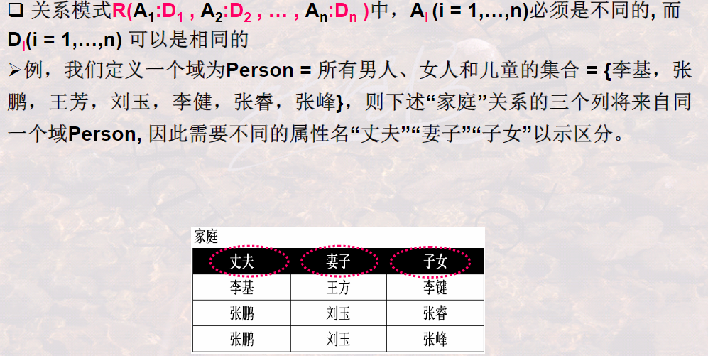
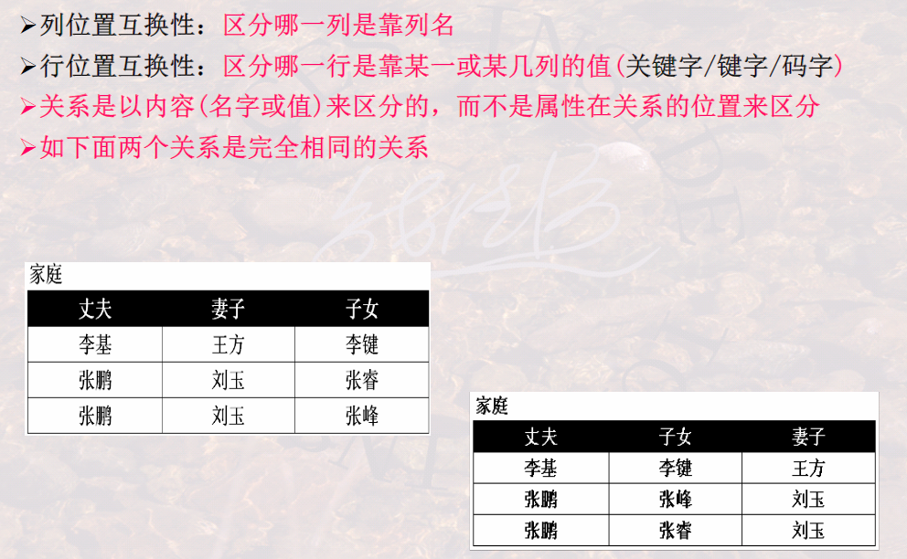
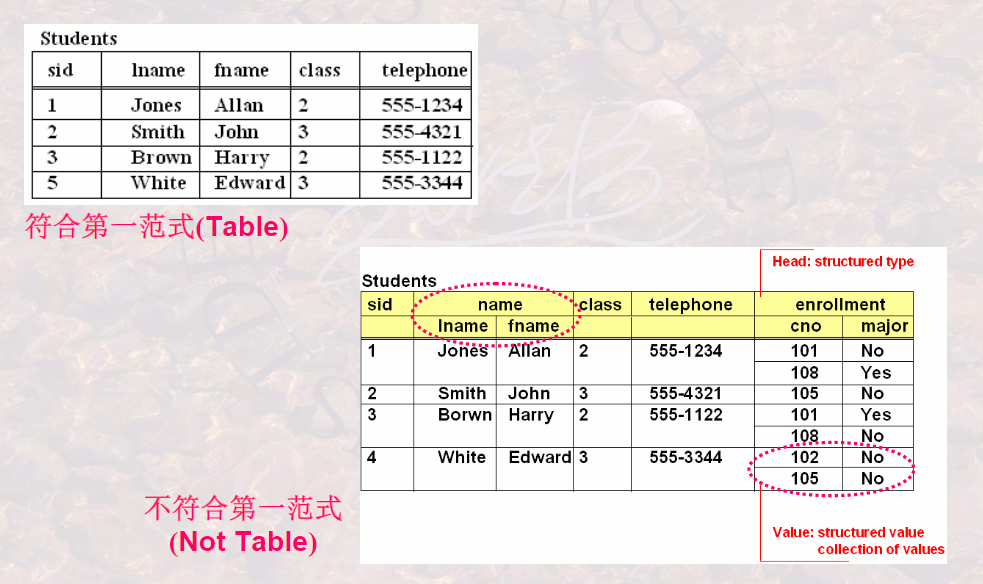
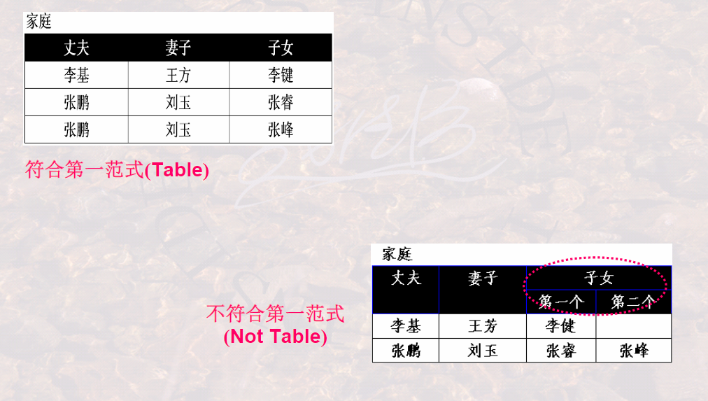

## 303关系有什么特性

**列是同质的，即每一列中的分量一般来自同一个域，是同一个类型的数据**

不同的列可以来自同一个域，称其每一个列为一个属性，不同的属性要给予不同的属性名.

**列位置互换性**

**行位置互换性**

理论上关系的任意两个元组不能相同，现实中表可能不能遵循这个原则.

元组相同是指两个元组的每个分量都相同.

属性不可再分特性又称为关系的第一范式。

符合第一范式的关系和不符合第一范式的关系的例子如下：

