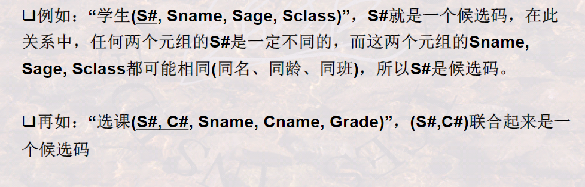
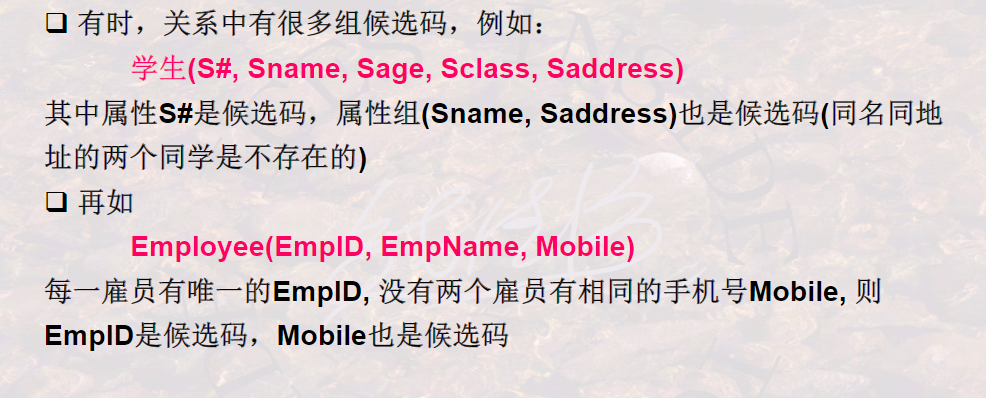
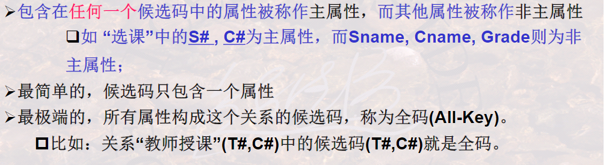
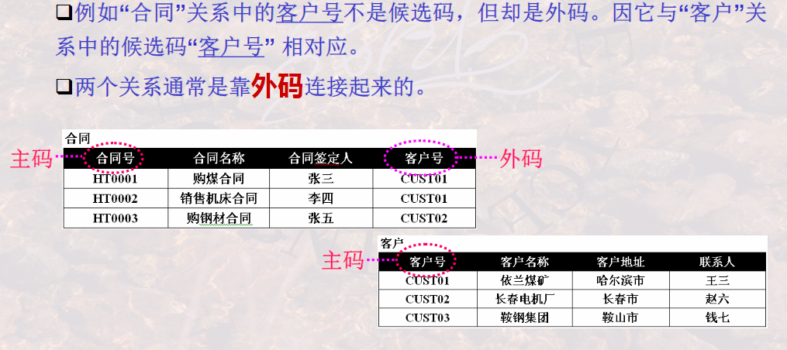
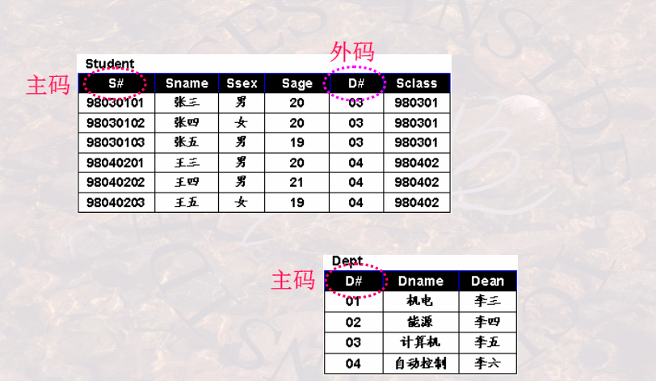
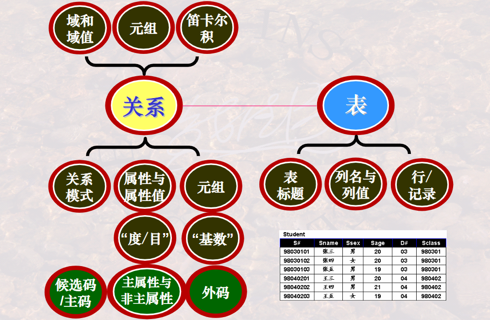

## 304候选码与外码

**候选码/候选键：关系中的一个属性组，其值能唯一标识一个元组，若从该属性组中删除掉任一个属性，他就不具备这一个性质了，这样的属性组称为候选码.**

### 主码/主键

**当一个关系中有多个候选码的时候可以选择一个来当主码.**

#### DBMS以主码为线索来管理关系中的各个元组.

### 主属性与非主属性

### 外码/外键

**关系R中的一个属性组，他不是R的候选码，但他与另一个关系S的候选码相对应（即它在关系S中是候选码），则这个属性组称为关系R的外码。**

例子如下：

### 小节

