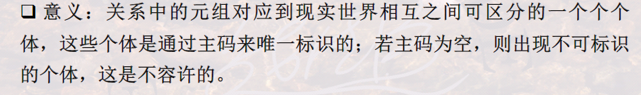
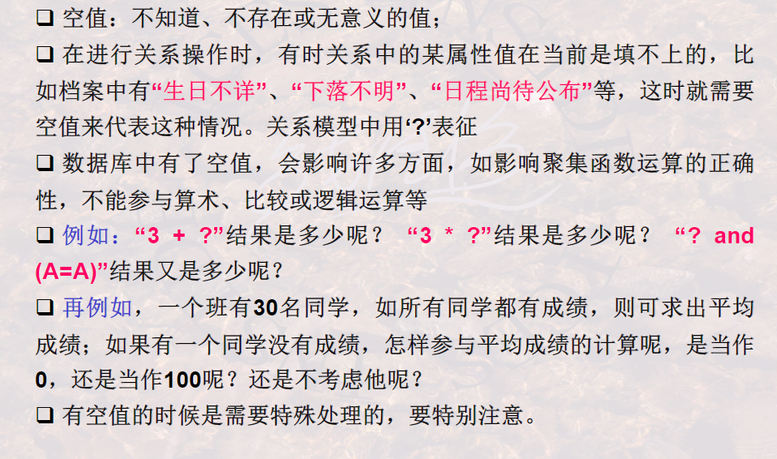
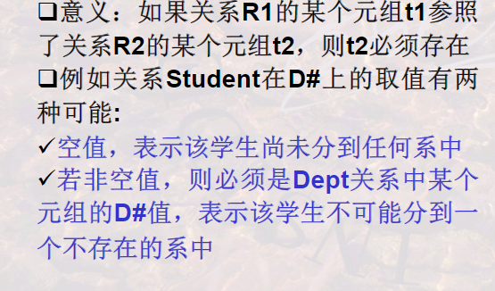
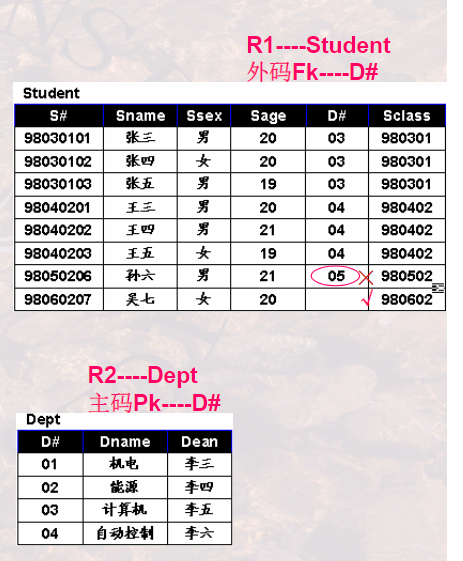
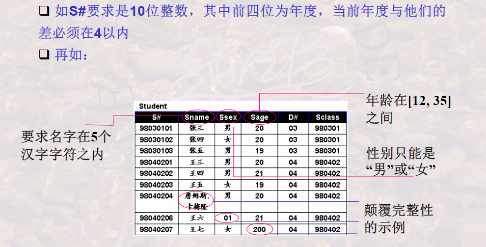
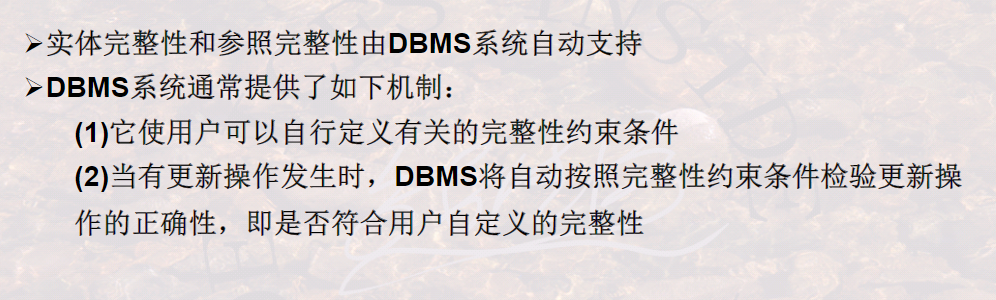

## 305关系模型的完整性

### 实体完整性

**关系的主码中的属性值不能为空值；**

**空值：不知道或者无意义的值；**

空值及其含义

### 参照完整性

**如果关系R1的外码Fk与关系R2的主码相对应，则R1中的每一个元组值Fk要么是的等于R2中某一个元组的Pk值，或者是一个空值.**

### 用户自定义完整性

**用户针对具体的应用环境定义的约束条件**

例子如下：

### DBMS对关系完整性的支持

