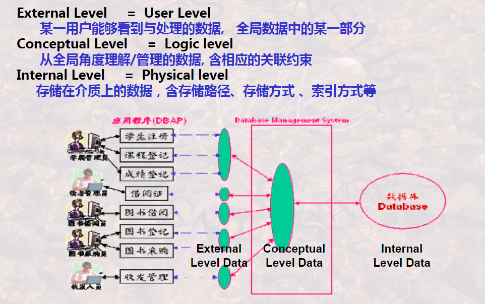
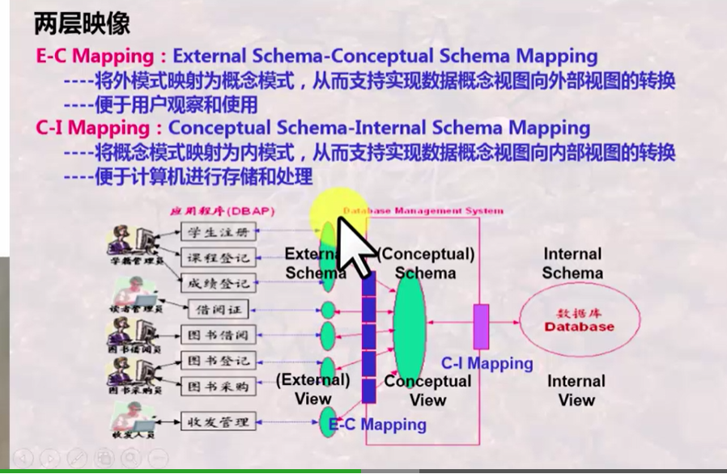
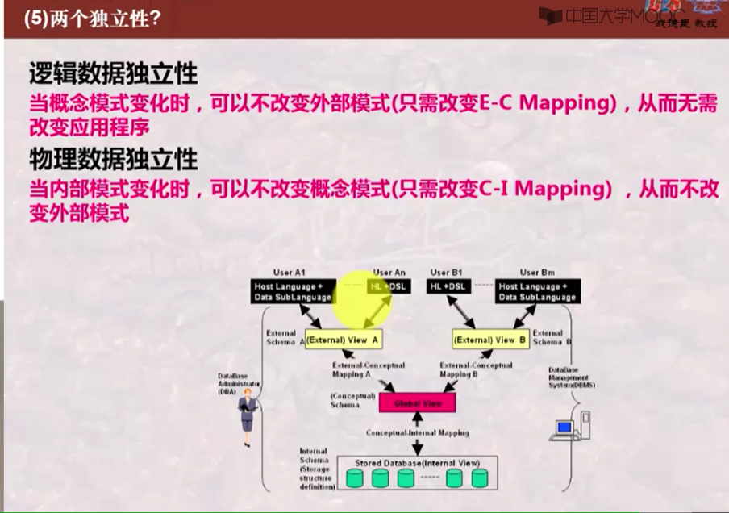

### 201数据库系统的标准结构

#### DBMS管理数据的三个层次

**用户层次**（**外模式**/**子模式**）（左边）

**概念层次**（**逻辑模式**/**概念模式**/**全局模式**）（中间）

**内部层次**（**内部模式**/**存储模式**）（右边）

<u>**三级模式两层映像是重点**</u>

### **三级模式**

**外模式**/**子模式**

**概念模式**/**全局模式**

**内部模式**/**存储模式**

### 两层映像

