## 203数据库系统的演变之一

数据库系统的演变： 从格式文件系统→网状层次数据库系统→关系数据库系统→如今的，数据库技术和各计算机技术结合，为各行各业提供专业化服务 

现在常用的数据库： 关系型数据库，对象关系数据库，面向对象数据库，多数据库开放式互连，以及数据库技术和各先进技术结合的数据库， 如 DB + Artificial Intelligence（数据库＋人工智能）， DB + Management Information System（数据库＋管理信息系统） DB + Image processing  / Multimedia processing（数据库＋图像/多媒体处理） 

管理的异同： 同：数据库系统的使用 异：数据模型，模式，E-C映像，C-I映像

### 简要的发展史：四个阶段

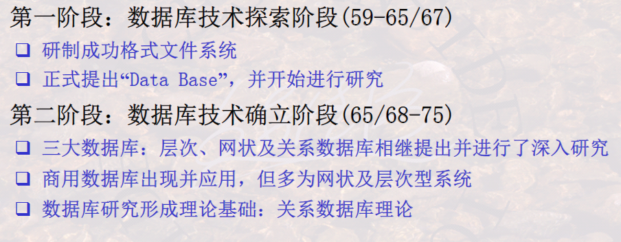

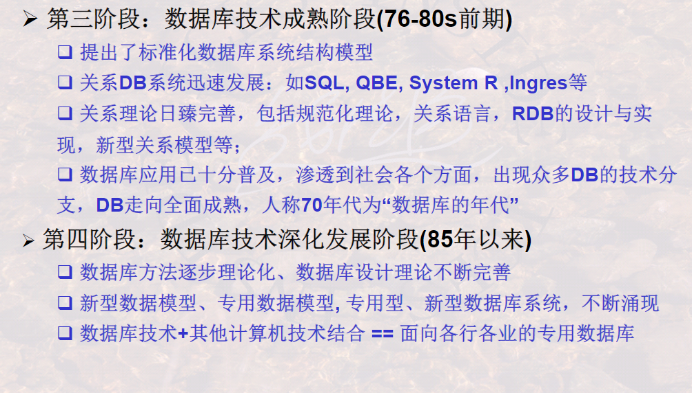

#### **1.重要发展：由文件系统到数据库**

**文件系统**

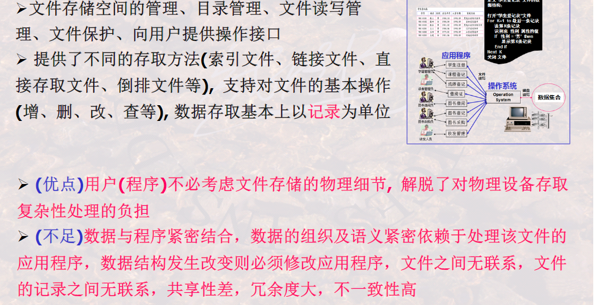

**数据库系统**

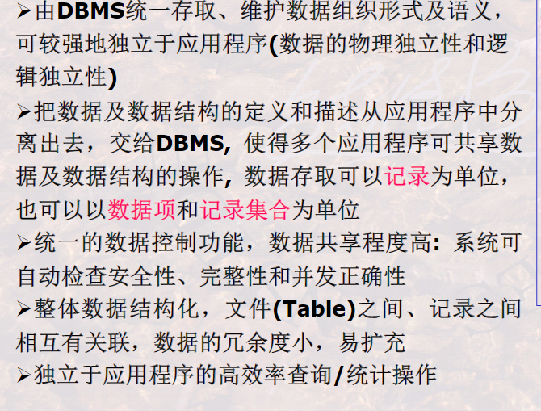

#### **2.重要发展：由层次模型数据库、网状模型数据库到关系模型数据库**

**层次模型与网状模型数据库**

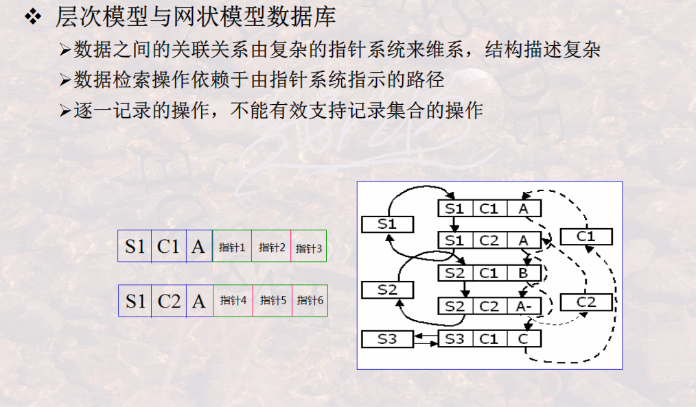

**关系模型数据库**

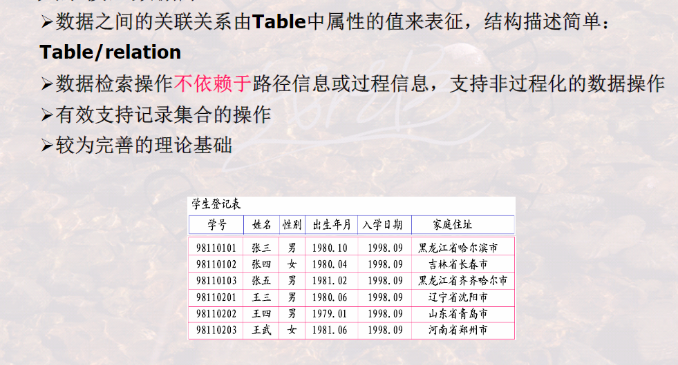

示例：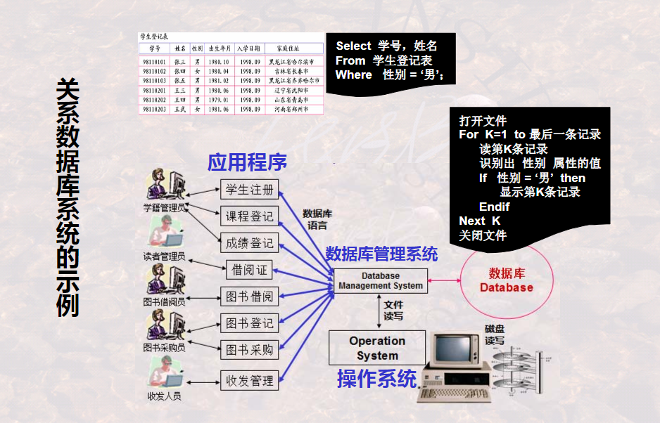

#### **3.重要发展：由关系数据库到对象关系数据库、面向对象数据库**

**关系数据库**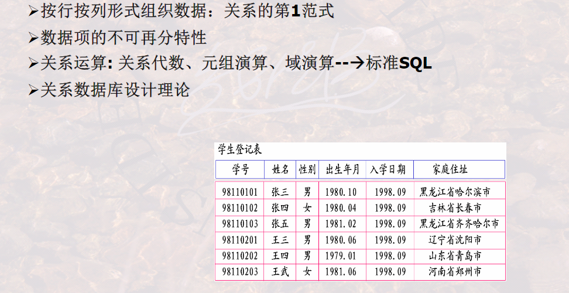

**对象--关系数据库**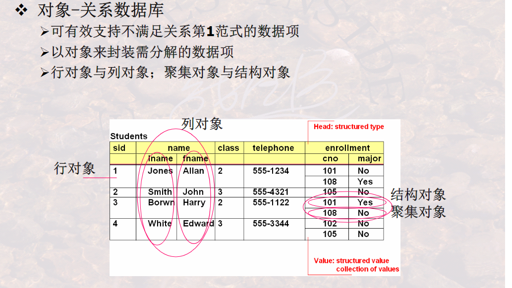

**图中画红色的圈表示不满足第一范式，即不支持关系数据库**

**引入对象可以解决这个问题**

**面向对象数据库**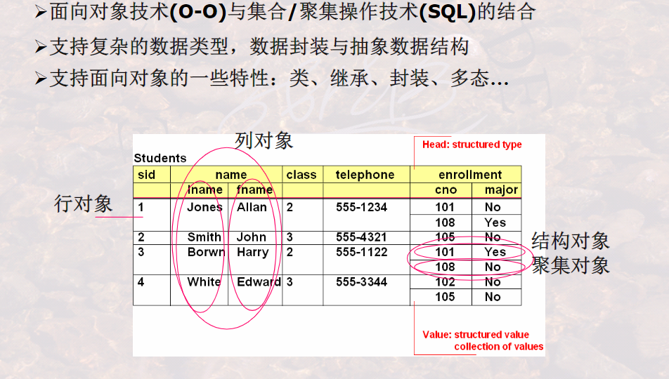

**XML数据库**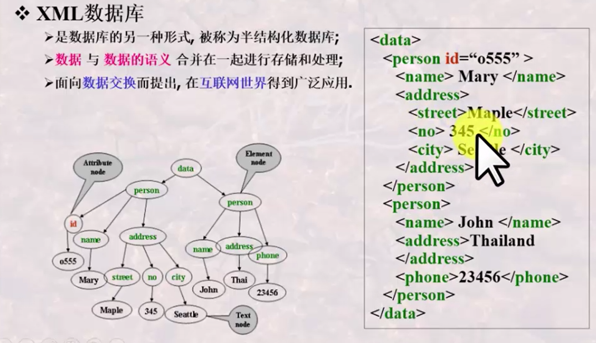

<>表示的是一个元素

#### **3.重要发展：有多种多样的数据库到多数据库开发互联**

**多种多样的数据库**

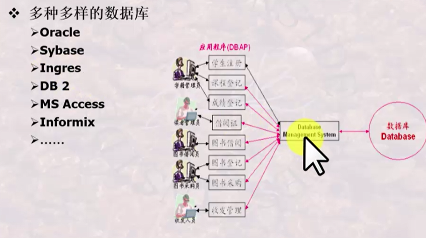

**开放互连多种多样的数据库**

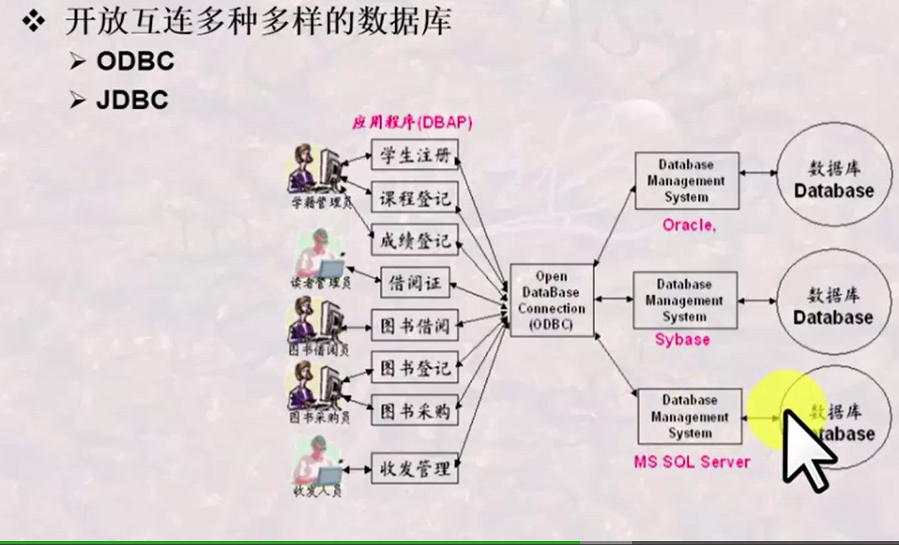

**JDBC（对于java环境）和ODBC（对于普通环境）是一种开放数据库互联的接口**

#### **4.重要发展：由普通数据库到与新型技术结合所形成的新型数据库**

**新型数据库**

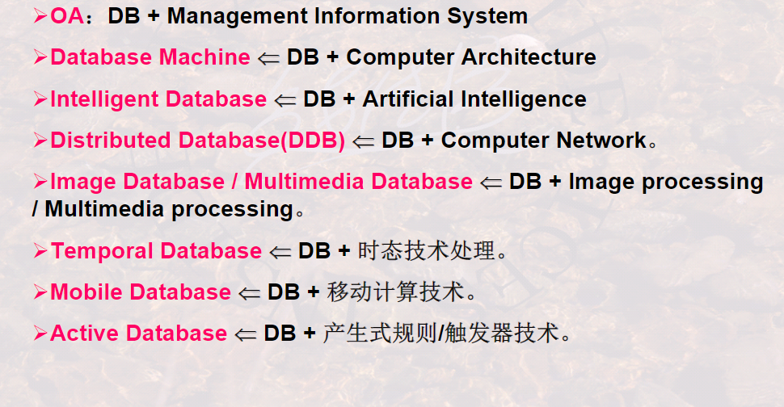

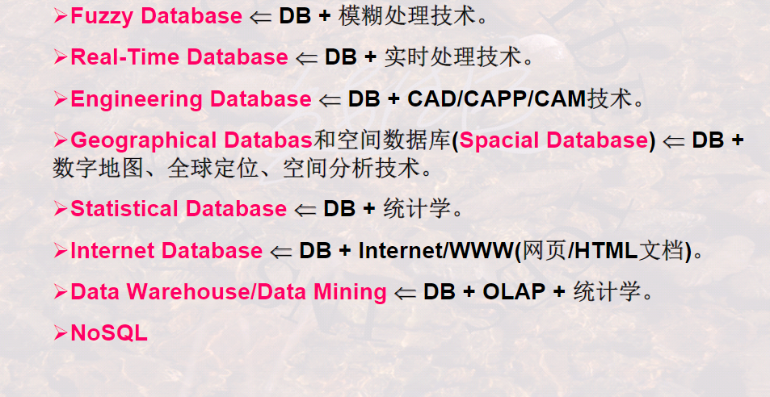