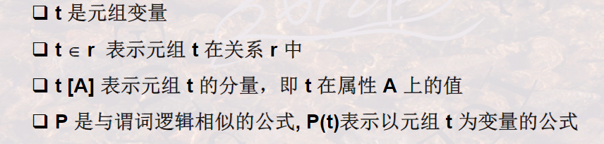
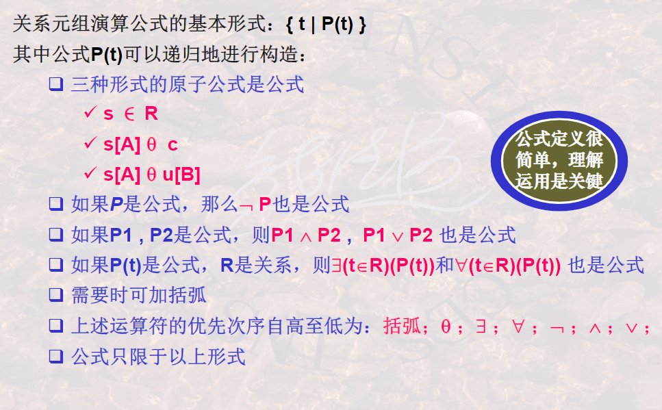

## 501什么是关系元组演算？

关系演算是以数理逻辑中的谓词演算为基础的

关系演算是描述关系运算的另一种思维方式

SQL语言是继承了关系代数和关系演算各自的优点所形成的

按照谓词变量的不同，可分为关系组演算和关系域演算

关系元组演算是以**元组变量**作为谓词变量的基本对象

关系域演算是以**域变量**作为谓词变量的基本对象

关系元组演算的基本公式：

``{t|P()}``

上式表示：**所有使谓词P为真的的元组t的集合**

P（t）可以如下递归的定义：

