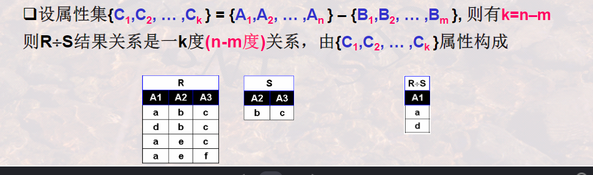
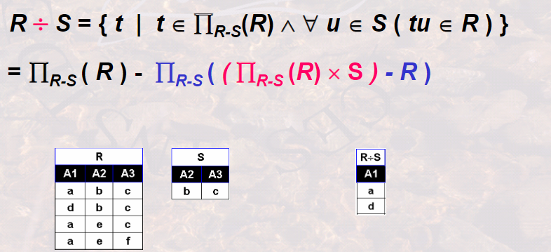
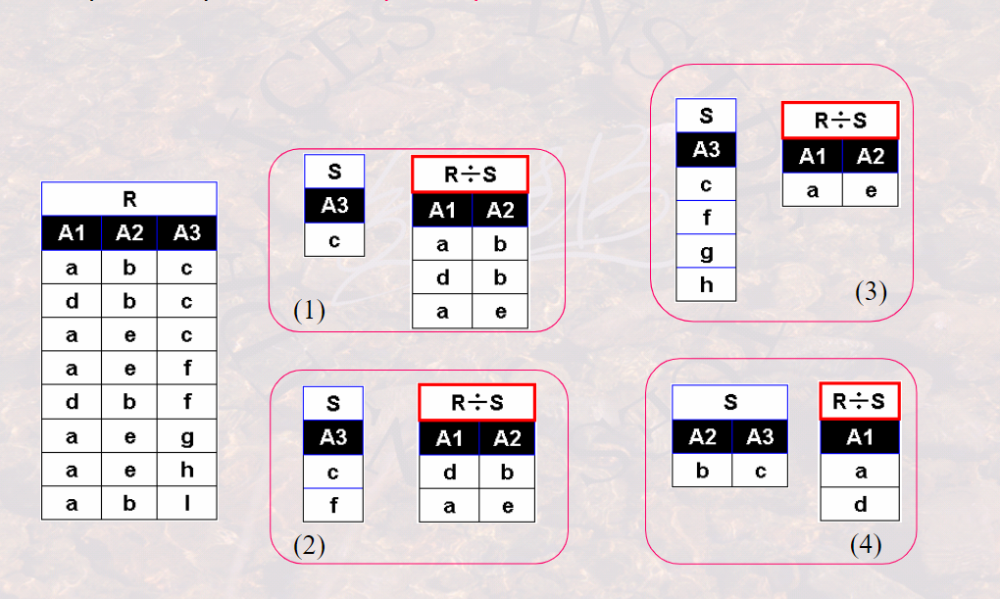
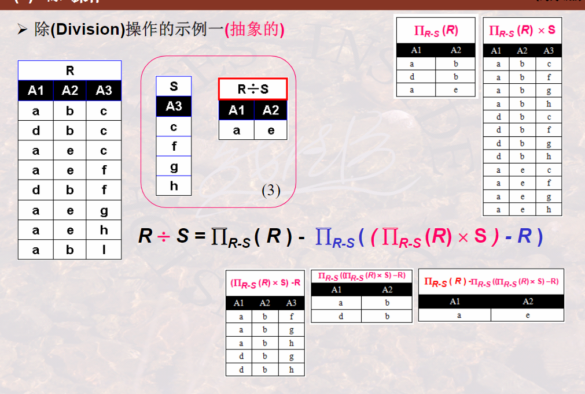
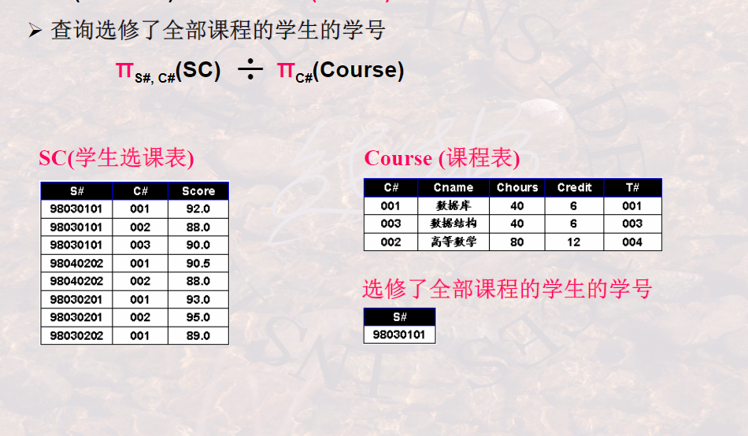

## 412除操作

### 除

**前提条件：给定关系`R（A1,A2,...,An）`为n度关系，关系`S(B1,B2,...Bm)`为m度关系。如果可以进行关系R与关系S的除运算，当且仅当：属性集`{B1,B2...,Bn}`是属性集`{A1,A2,...,An}`的真子集，即`m<n`.**

**定义：关系R和关系S的除运算结果也是一个关系，记作`R÷s`,分两部分来定义.**

数学描述：

除操作的示例（抽象的）

示例二（语义的）

示例三（语义的）

